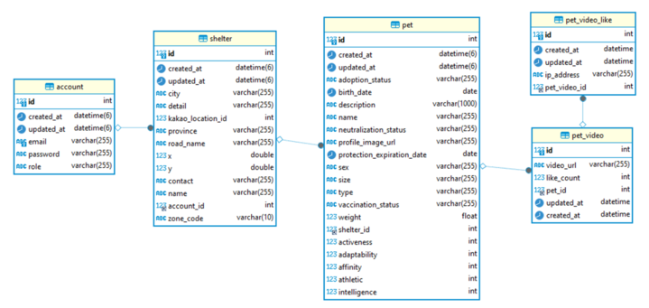

  
  <h2> 반려동물과 함께하는 삶의 기억들이 만나는 곳 </h2>

   
   
  <strong>애니모리</strong>는 반려인이 되고자 하는 사람들과 
   
  새로운 가족을 기다리는 유기동물들에게 따뜻한 만남을 선사합니다.
   
   

---

### [기획안]

### [요구사항 명세](https://github.com/Step3-kakao-tech-campus/Team16_BE/wiki/%EC%9A%94%EA%B5%AC%EC%82%AC%ED%95%AD-%EB%AA%85%EC%84%B8)

### [UI 설계(Figma)](https://www.figma.com/file/A0w3m1DU5JJm2zzvo9lnGE/16%EC%A1%B0-%EC%83%88%EA%B8%B0%ED%9A%8D?type=design&node-id=1-248&mode=design)

### Entity Relation Diagram

### [배포되어 있는 공식 인스턴스](https://k6958d08a6ee5a.user-app.krampoline.com)
- [개발 환경 서버 인스턴스 주소](http://ec2-3-37-14-140.ap-northeast-2.compute.amazonaws.com)

### BE 팀 구성도
<table>
  <tr>
    <td align="center"></td>
    <td align="center"></td>
    <td align="center"></td>
    <td align="center"></td>
  </tr>
  <tr>
    <td align="center"><a href="https://github.com/rnjsgo">권해</a></td>
    <td align="center"><a href="https://github.com/yuseonkim">김세인</a></td>
    <td align="center"><a href="https://github.com/jminkkk">김지민</a></td>
    <td align="center"><a href="https://github.com/latteisacat">임도현</a></td>
  </tr>
<table>

---

# 🐾 구현

## 💡 공통 코드
### 예외처리
- 서버에서 처리할 수 있는 가능한 모든 예외 상황을 분석한 후, 그에 맞는 예외 처리 전략을 수립하였습니다. 이를 통해 사용자에게 의미 있는 오류 메시지를 제공하고, 잘못된 요청에 대한 처리를 효율적으로 수행할 수 있습니다.
- 또한, 비즈니스 로직에 특화된 커스텀 예외를 생성하여, 더욱 구체적인 예외 상황을 표현하였습니다. 이를 통해 클라이언트에게 정확한 오류 원인을 알려줄 수 있습니다.
- 처리한 예외들에 대해서는 스웨거 문서를 통해 클라이언트에게 전달하였습니다. 이를 통해 클라이언트 개발자들이 API 사용 시 예외 상황에 대해 미리 인식하고 대응할 수 있습니다.
### 인증/인가
- 스프링 시큐리티를 이용하여 기본적인 인증과 인가를 처리하였습니다. 특히 JWT를 이용하여 상태를 유지하지 않는(Stateless) 인증 방식을 구현하였습니다.
- JWT는 클라이언트에게 토큰을 발급하고, 이 토큰을 이용해 사용자를 식별하며, 이를 통해 사용자의 요청에 대한 권한을 검증합니다.
### 로깅
- logback으로 필요한 로그만 profile별 각각 콘솔 출력과 파일 저장으로 읽기 좋게 형식을 맞춰서 적용하였습니다.
- AspectJ 로 모든 Request 정보를 기록하고, 모든 method의 실행시간을 측정하였습니다.
### 재사용 모듈
- Pagination이 여러 API들에서 사용되고 있어서, 기본 Page객체로부터 pageNumber, size, totalPages 등의 필요한 정보만 꺼내서 사용하는 클래스(Dto에서 상속하여 사용)
- BaseEntity라는 이름으로, Entity에서 상속하여 사용할 수 있도록 구현하여 모든 레코드의 생성날짜와 최종수정시각을 기록했습니다.
### API Response Object
- Http Response Body에 success, response json object, error message 등을 정의했습니다.(이전 단계부터 팀 전체에 익숙한 형식을 회의를 통해 그대로 사용)
## 💡 API
### account
- 계정 생성, 로그인 등을 담당합니다. 현재는 사용자 접근성을 위해 보호소(`Shelter`) 계정만 존재하지만 향후 `Shelter` 뿐 아니라, 일반 유저 등 새로운 계정 역할 및 기능이 추가될 가능성을 고려하여 별도로 분리해뒀습니다.
### fileserver
- 이미지, 동영상 처리
- SpringBoot Application 서버에 직접 직접 파일을 업로드/다운로드하는 구현을 먼저 사용하였고, 서버 재배포와 데이터베이스 초기화 등의 작업환경에서 더미데이터로 사용할 이미지와 비디오 파일들을 독립적으로 유지할 필요, 저장 로직의 롤백 등을 위해서 간단하게 Free Tier의 AWS S3를 도입하였습니다.
- `FileRepository`라는 이름으로 `save, deleteAll` 등 JPA와 동일한 메소드 이름으로 추상화하였습니다.
- 사용자가 이미지나 동영상을 업로드하면, S3에 저장하고, 저장된 리소스에 대한 URL을 반환합니다. 클라이언트에서 URL을 이용하여 필요한 시점에 이미지나 동영상을 서버 상태에 독립적으로 다운로드할 수 있습니다.
### pet
- 서비스 핵심이 되는, 보호소에서 관리중인 유기동물들의 데이터를 다룹니다.
### shelter
- 보호소와 관련된 정보들을 조건에 맞게 조회, 수정합니다. 보호소 권한에 한해서만 보호소가 관리하는 유기동물 즉, pet 등록, 수정이 가능합니다.
### shortform
- short-form video 라는 뜻으로, 데이터 모델의 관점에서는 Pet의 Video파일들을 조회하는 API입니다. 중요도와 크기, 확장성 등을 고려해서 Pet domain과 코드, API를 별도로 분리하였습니다. 비디오 파일들을 간단한 피드 형식으로 제공하고 있습니다.
    
## 💡 기타 도구 사용, 문서
### DB History 문서
- DB Migration 도구(Flyway)를 사용하다가, 최신버전이 MySQL 8.0.33 에서 지속적으로 버그가 발생해서 제거하고, 스키마 구조가 변경되는 이력을 확인할 수 있는 문서(SQL)만 resources 폴더에 추가해가면서 운용했습니다.
### Springdoc
- 간단하게 Controller의 Interface를 만들어서 Springdoc의 문서화 annotation들을 관리했습니다.

## 💡 테스트
### 테스트 환경 전체
  - Embedded H2를 사용했습니다.
### 인수테스트(SpringBootTest + WebMvc)
- 통합테스트 + Usecase관점에서의 요구사항 충족을 확인하는 문서역할로 사용했습니다.
- `@BeforeEach` 로 테스트 마다 Dummy Data 생성.
### 유닛테스트
- SQL 쿼리 확인을 위한 `@DataJpaTest`
- Request → Dto 검증을 위한 `@WebMvcTest`
- 필요하다고 생각한 경우, `Mockito`를 사용하여 Service Layer를 테스트
- utility 성격으로 별도로 구현한 클래스들에 대해서는 `Autoparams`라는 서드파티 라이브러리와 `ParameterizedTest` 를 사용하여 치밀하게 테스트 하였습니다.

## 💡 빌드, 배포 환경 관리
### 개발환경
- GitHub Actions를 통해 Pull Request과정에서 리눅스 환경에서의 테스트를 수행하고, 배포 환경에서는 booJar만 수행하였습니다.(빌드-배포 시간단축)
- 프론트엔드 팀에서 변경사항을 바로 확인하면서 작업이 지체되지않도록 GitHub push 이후, 배포 자동화를 구성하였습니다.
- 데이터베이스 스키마와 기본 API가 갖춰지고 난 후에는 테스트 용 데이터를 배포마다 새로생성하기 번거로워서 독립적으로 유지되는 MySQL container를 별도로 구성하였습니다.
### 제출환경
- 기존 docker 기반으로 띄워놓은 ec2의 배포 환경을 kubernetes 기반의 배포 환경으로 바꾸기 위해 예정에 없었던 nginx와 kubernetes를 공부하게 되었습니다.
- 카카오 크램폴린이라는 배포 환경은 사내 보안 규정 상 외부 요청이 http 통신 외에는 불가능 했기에 외부 db를 사용할 수 없어 관리가 좀 불편해도 db를 가져와 내부에서 띄우기로 결정했습니다.
- ec2에서 사용한 db를 백업본을 통해 크램폴린에 띄운 mysql의 statefulset에 적용시켜 최신파일 적용 시에도 db는 변경되지 않도록 하였습니다.
- react 빌드 파일에 nginx가 직접 접근하여 라우팅 할 수 있도록 nginx와 react를 별도의 pod가 아닌 한 pod 내에서 실행시켰습니다.
- 보통 자동 생성되는 /etc/nginx/mime.types 파일이 생성되지 않는 버그가 있어 직접 configMap을 통해 넣어주었습니다.
- nginx를 배포한 파드 내의 /etc 아래의 디렉토리 권한이 read-only로 설정되는 버그가 있어 빌드 파일 위치를 /var 디렉토리로 옮겼습니다.
