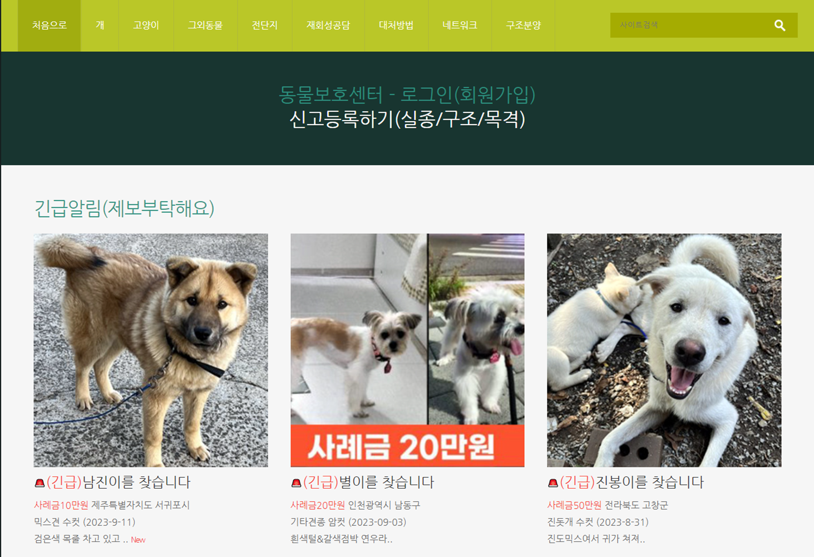

### 문제와 목표

**유기동물 “발생현황” → 매년 10만 마리 이상**

**절반은 안락사 및 자연사**

**펫숍 입양의 23.1% 는 유기동물 입양의 19.9% 에 더해질 수 있음 = 43%**

**유기동물 보호소 웹 사이트**

 유기동물 보호소들에 대한 정보들을 잘 제공해주는 웹사이트들이 이미 여럿 있다. 

이 서비스들은 모두 **“정보공유” 가 초점**인 정부 및 민간서비스로, 입양 대기중인 유기동물들과 입양절차 등과 관련한 정보를 제공하는데에 이미 훌륭하지만, **접근이 어렵다**.

**접근이 어렵다는 것은 무슨 뜻?**

- 반려동물을 입양하려고 할 때, 구매하지 않더라도 **보호소나 임보자를 통해 입양할 수 있다는 생각 자체를 떠올리지 못하는 경우**도 있을 것
- 이런 웹 사이트에 진입하는 사람들은 대부분, 이미 유기동물 현황과 문제점 등을 잘 알고 있거나 **입양 절차에 대해 이해**하고 있고 **입양 의사가 정해진** 사람들일 가능성이 높다고 생각.(보호소라는 키워드로 열심히 검색해서 찾아야만 등장하기 때문)

**유기동물에 대한 편견**

반려동물을 기르고자 하는 의사가 있더라도 유기동물은 꺼려하는 경향

- 동물복지문제연구소 어웨어의 ‘2022 동물복지에 대한 국민인식조사’에 따르면 이 조사에 참여한 반려동물 양육자 477명 중 동물을 기르게 된 경로로 ‘유기동물을 입양했다’고 응답한 비율은 7.5%에 불과했습니다.
- 유기동물 입양 계획이 없다는 사람에게 그 이유를 물었을 땐 ‘입양 방법이나 절차가 어려울 것 같다’(34.7%), ‘질병이 있을 것 같다’(20.4%), ‘행동 문제가 있을 것 같다’(16.5%) 순으로 높은 응답률을 보였습니다.  하지만 이것은 **잘못 알려진 편견(꼭 그렇지는 않다)**에 해당하고, 인식이 개선될 필요가 있습니다.
- [유기견 어딘가 아플 것 같다고요? 오히려 건강합니다!](https://weekly.donga.com/society/3/05/11/4011670/1)

**1차 피드백 반영: 10여 곳 보호소 문의 결과**

지자체에서 운영하는 보호소에서 안락사 날짜에 가까워진 유기동물들을 민간 보호소에서 데려와 보호하고 있는 구조.

민간 보호소의 경우 환경이 열악함.

- 공공기관에서 운영하는 웹 사이트에서 유기동물 입양 홍보를 받아주지 않는다고 함.
- 유튜브, 인스타그램 등을 이용하여 홍보하고 있으나 해당 플랫폼 외부까지는 연결되기 어렵다고 느낌

입양 절차 중, 서류로 해결할 수 있는 부분들은 온라인으로 이미 진행하고 있는 경우도 있다고 함.

웹 사이트 이용의 어려운 점

- 사진 업로드 제한
- 불편한 UX

문의한 곳 모두, 입양률이 증가한다고해서 이익을 보는 것은 없다고 생각하지만, 입양률 증가에 효과가 있다면 번거로운 작업을 기꺼이 하겠다고 답했음.

### 제안

### 정보 공유가 주가 아닌, 반려동물에 대한 즐거운 콘텐츠를 제공하는데에 집중해보자.

- 숏폼과 이미지를 이용해 유기동물들이 행복하게 지내는 컨텐츠를 제공해서 **인식을 개선**하고 반려동물 자체에 대한 **관심도 유도**할 수 있을 것.
    - 보호소나 임보자들과 유기동물들의 행복한 일상을 담은 비디오(숏폼)와 이미지들을 공유하는 공간을 제공합니다. → 기존의 서비스들보다 더 가벼운 마음으로 쉽고 재미있게 유기동물들의 삶에 접근할 수 있고, 입양으로 이어지는 것(첫 전화 한 통을 걸어보는 것이 어렵다)을 기대할 수 있을것이라 생각합니다.
- 추가적으로 커뮤니케이션 기능 강화를 위해 SNS의 색깔을 띠는 서비스를 제공하는 방향을 고려한다.

| 공급\수요 | 현재 입양 의사가 있는 개인 | 현재 입양 의사가 없는 개인 |
| --- | --- | --- |
| 임시보호자, 보호소와 살고있는 유기동물들 | ANIMORY V1.0 | 반려동물에 대한 관심 증가, 유기동물 인식 개선 |
| 반려동물 콘텐츠를 업로드하고자 하는 개인 | 네트워킹 | SNS 기능 고도화(V2.0) |
